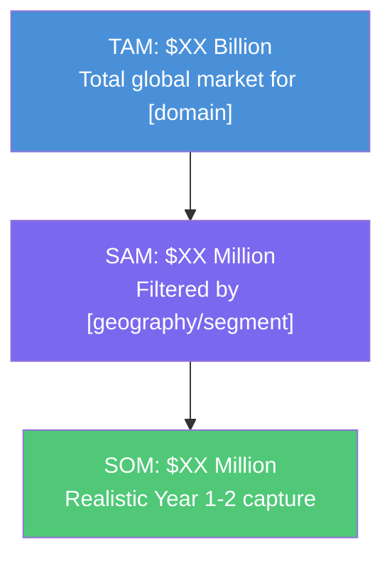
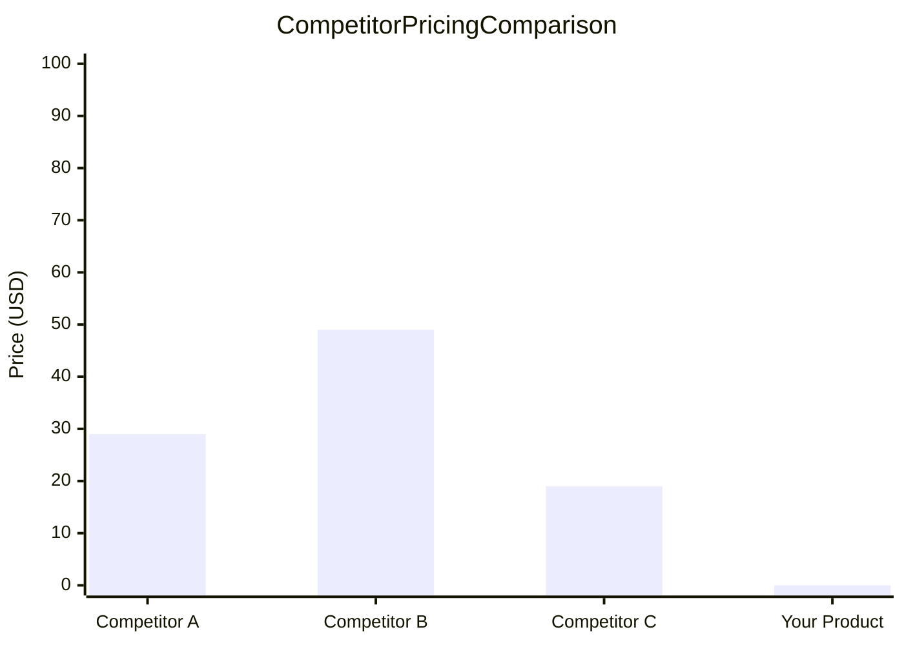
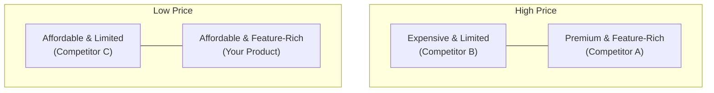
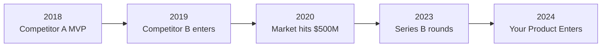
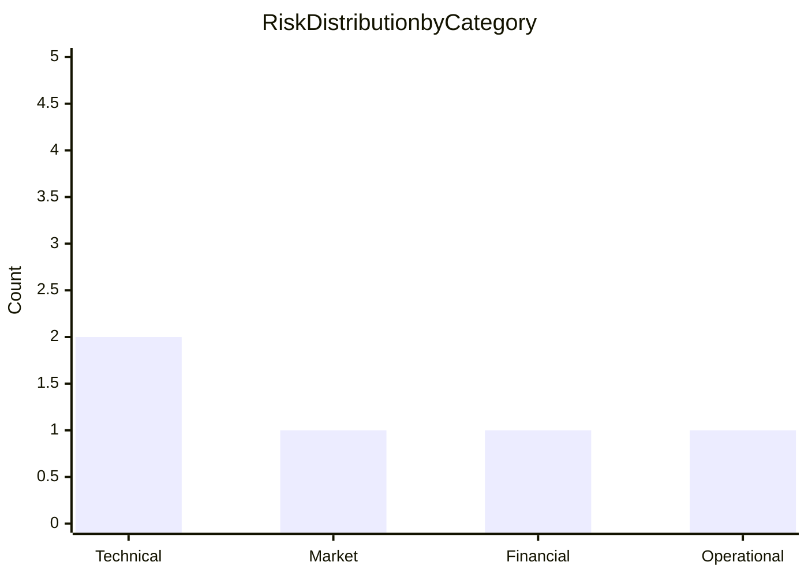

# Product & Competitor Analyzer

## Overview

This skill transforms a product idea into a professional market analysis report.
When invoked, the AI conducts mandatory live web searches across search engines,
Reddit, HackerNews, app stores, and industry sources. It then synthesizes the
findings into a comprehensive, editable Markdown report file containing Mermaid
diagrams, comparison tables, factual numbers with citations, and a final
feasibility verdict.

The output is a standalone file named `market-analysis-[app-slug].md` that is
ready to share, edit, or present.

## Dependencies

This skill references and combines methodologies from the following skills:

| Skill | Purpose |
|---|---|
| `bmad-forge-idea` | Pressure-tests the core concept for fatal flaws |
| `bmad-market-research` | Structured market research methodology and citation standards |
| `bmad-cis-innovation-strategy` | Gap identification and disruption strategy |
| `bmad-prfaq` | Working Backwards feasibility synthesis |

## Quick Start

To invoke this skill, provide the AI with the following context:

```
Analyze this product idea using the product-competitor-analyzer skill:
- Product Name: [Your App Name]
- Description: [What it does and the problem it solves]
- Target Audience: [Who will use it]
```

The skill will automatically search the web, analyze competitors, and generate
a report file in your current directory.

## Workflow

### Phase 1: Intake

Collect the following from the user. If any field is missing, ask before proceeding.

| Field | Required | Example |
|---|---|---|
| Product Name | Yes (or "TBD") | "QuickWash" |
| Core Problem / Description | Yes | "On-demand laundry pickup and delivery app" |
| Target Audience | Yes | "Busy professionals aged 25-40 in urban areas" |
| Known Competitors (optional) | No | "Washio, Rinse, Cleanly" |

**Derive a kebab-case slug** from the product name for the report filename.
Example: `QuickWash` becomes `quickwash`, `My Cool App` becomes `my-cool-app`.

---

### Phase 2: Deep Web Search (Mandatory -- Zero Hallucination Policy)

> **CRITICAL RULE:** You are FORBIDDEN from generating any competitor name,
> statistic, rating, price, or market claim without first finding it through
> a web search. If a search returns no results for a specific query, state
> "No data found" rather than inventing information.

You MUST execute **at minimum 6 separate `search_web` calls**:

| # | Search Query Pattern | Purpose |
|---|---|---|
| 1 | `"best [problem domain] apps [current year]"` | Discover direct competitors |
| 2 | `"[problem domain] alternatives comparison"` | Discover indirect competitors and workarounds |
| 3 | `site:reddit.com "[competitor name]" OR "[problem domain]" complaints OR problems OR hate` | Reddit sentiment and pain points |
| 4 | `site:news.ycombinator.com "[problem domain]" OR "[competitor name]"` | HackerNews technical community sentiment |
| 5 | `"[competitor name]" app store reviews rating` | App Store / Play Store ratings and reviews |
| 6 | `"[competitor name]" pricing plans cost` | Competitor pricing models |

**Citation Rule:** Every single data point in the report MUST end with
`[Source: URL]`. If a fact cannot be verified through search, mark it as
`[Estimated -- not verified]`.

---


### Phase 2.5: SaaS Intelligence Sources (Mandatory for SaaS Products)

When the product being analyzed is a SaaS, web app, or subscription-based product, the
AI MUST query the following specialized platforms IN ADDITION to the standard Phase 2
web searches:

| # | Platform | What to Search For | URL |
|---|---|---|---|
| 1 | **IndieHackers** | Revenue milestones, founder stories, MRR reports | `site:indiehackers.com "[competitor]" OR "[problem domain]" revenue` |
| 2 | **OpenStartup / Baremetrics Open Startups** | Public revenue dashboards (MRR, churn, LTV) | `site:baremetrics.com/open "[competitor]"` |
| 3 | **SaaS Pegasus / MicroConf** | SaaS growth strategies and validated ideas | `site:microconf.com "[problem domain]"` |
| 4 | **BuiltWith** | Technology stack and market share of competitors | `site:builtwith.com "[competitor domain]"` |
| 5 | **SimilarWeb** | Traffic estimates, audience demographics, top pages | `"[competitor domain]" site:similarweb.com` |
| 6 | **Crunchbase** | Funding rounds, investors, revenue estimates, employee count | `site:crunchbase.com "[competitor name]"` |
| 7 | **Product Hunt** | Launch metrics, upvotes, community reception | `site:producthunt.com "[competitor]" OR "[problem domain]"` |
| 8 | **G2 / Capterra** | Enterprise reviews, satisfaction scores, feature comparison | `site:g2.com "[competitor]" reviews` |
| 9 | **TrustRadius** | In-depth B2B reviews and competitor alternatives | `site:trustradius.com "[competitor]"` |
| 10 | **Exploding Topics** | Trending market signals and emerging competitors | `site:explodingtopics.com "[problem domain]"` |

**Rule:** For each SaaS competitor, you MUST attempt to find at least ONE of the
following data points: MRR/ARR, funding raised, estimated traffic, or public revenue
dashboard. If none can be found, explicitly state `[Revenue data not publicly available]`.

---

### Phase 3: Competitor Teardown

For **each** competitor discovered (minimum 3, maximum 5), extract and document:

| Data Point | Where to Find It |
|---|---|
| Name & URL | Search result |
| Pricing model & plans | Competitor's website or comparison articles |
| Number of users/downloads | App store pages, press releases, or articles |
| App Store / Play Store average rating | App store search |
| Top 3 negative reviews (verbatim quotes) | App store reviews, Reddit, Trustpilot |
| Top 3 user-requested missing features | Reddit threads, feature request forums |
| Year founded / launched | Company website or Crunchbase |

Output this as a **structured comparison table** in the report.

---


### Phase 3.5: Market Sizing (TAM / SAM / SOM)

Before analyzing individual competitors, the AI MUST estimate the market size using
the following framework:

| Metric | Definition | How to Estimate |
|---|---|---|
| **TAM** (Total Addressable Market) | Total global demand for this type of product | Search for industry reports, market size articles: `"[problem domain] market size [current year]"` |
| **SAM** (Serviceable Addressable Market) | The segment of TAM your product can realistically serve | Filter TAM by geography, platform, and target audience constraints |
| **SOM** (Serviceable Obtainable Market) | The realistic share you can capture in Year 1-2 | Based on competitor market share and your differentiation |

Generate the following Mermaid funnel diagram in the report:



**Citation Rule:** Market size numbers MUST come from search results (Statista,
Grand View Research, Fortune Business Insights, or press articles). If no reliable
source is found, use `[Estimated based on competitor revenue data -- not verified]`.

---

### Phase 4: Competitive Comparison Charts

Generate the following visual elements using **Mermaid diagram syntax** in the report:

#### 4.1 -- Pricing Comparison Bar Chart



Replace the placeholder values with real pricing data from Phase 2.

#### 4.2 -- Feature Comparison Matrix

Create a Markdown table comparing each competitor across key features:

| Feature | Competitor A | Competitor B | Competitor C | Your Product (Planned) |
|---|---|---|---|---|
| Feature 1 | Yes | No | Yes | **YES (Killer)** |
| Feature 2 | No | Yes | No | **YES (Killer)** |
| Feature 3 | Yes | Yes | Yes | Yes |

Mark features that competitors lack and your product will have as **bold**.

#### 4.3 -- Competitive Position Quadrant



Replace coordinates with estimated positions based on research.

---


#### 4.4 -- Competitor Growth Timeline

Generate a Mermaid timeline diagram showing the competitive landscape evolution:



Replace all placeholder data with real dates and milestones discovered during Phase 2.
This timeline helps the user understand the market's maturity and timing window.

---

### Phase 5: Market Gap & Killer Features

Based strictly on the social media sentiment and competitor weaknesses
discovered in Phases 2-3:

1. **Identify 1-3 "Killer Features"** that competitors completely lack.
   Each feature MUST be backed by at least one social media quote or user
   complaint demonstrating demand. Format:

   > **Killer Feature:** [Feature Name]
   > **Evidence:** "[Exact user quote from Reddit/HN]" [Source: URL]
   > **Why it matters:** [Brief explanation]

2. **Differentiation Strategy:** In 2-3 sentences, define how this product
   should be positioned so users immediately see it as different from clones.

3. **Gap Validation:** For each identified gap, explicitly check:
   Has ANY competitor already solved this? If yes, cite the source. If no,
   this is a confirmed opportunity.

---


### Phase 5.5: SaaS Unit Economics (Mandatory for Subscription Products)

For any product with a subscription or recurring revenue model, the AI MUST estimate
the following unit economics based on competitor data and industry benchmarks:

| Metric | Formula / Estimation Method | Why It Matters |
|---|---|---|
| **CAC** (Customer Acquisition Cost) | Search for competitor ad spend, marketing channels | Determines if growth is financially sustainable |
| **LTV** (Lifetime Value) | Average Revenue Per User x Average Customer Lifespan | Must be at least 3x CAC to be viable |
| **LTV:CAC Ratio** | LTV / CAC | Below 3:1 = unsustainable, above 5:1 = excellent |
| **Payback Period** | CAC / Monthly Revenue Per User | How many months to recover acquisition cost |
| **Estimated Churn Rate** | Search for industry benchmark churn rates | SaaS average is 5-7% monthly for SMB |
| **MRR to Break Even** | Fixed costs / Average Revenue Per User | Minimum subscriber count to sustain operations |

Generate the following comparison in the report:

| Metric | Industry Benchmark | Competitor A | Competitor B | Your Product (Projected) |
|---|---|---|---|---|
| Monthly Price | $XX | $XX | $XX | $XX |
| Estimated Churn | X% | X% | X% | Target X% |
| LTV:CAC Ratio | 3:1 | X:1 | X:1 | Target X:1 |
| Payback Period | X months | X months | X months | Target X months |

**Search Query:** `"[problem domain]" SaaS benchmarks churn rate LTV CAC [current year]`

**Rule:** If exact competitor data is unavailable, use industry benchmarks from
SaaS surveys (e.g., ProfitWell, ChartMogul, Baremetrics reports) and cite the source.

---

### Phase 5.8: SWOT Analysis

Synthesize all findings from Phases 2-5 into a structured SWOT analysis:

Provide the detailed breakdown in table format:

| Category | Item | Evidence / Source |
|---|---|---|
| **Strengths** | [What your product does better than competitors] | [Source: URL] |
| **Strengths** | [Unique technical advantage or team capability] | [Based on gap analysis] |
| **Weaknesses** | [What competitors do better than you] | [Source: URL] |
| **Weaknesses** | [Resource or expertise gaps] | [Based on intake] |
| **Opportunities** | [Unmet market demand discovered in social media] | [Source: URL] |
| **Opportunities** | [Emerging trend or underserved segment] | [Source: URL] |
| **Threats** | [Well-funded competitor entering your niche] | [Source: URL] |
| **Threats** | [Regulatory or platform dependency risk] | [Source: URL] |

**Rule:** Every SWOT item MUST trace back to a specific finding from an earlier phase.
No generic or hypothetical SWOT items allowed.

---

### Phase 6: Risk & Challenge Analysis

List the **top 5 risks/challenges** the project faces. For each risk:

| Risk | Category | Has a Competitor Solved It? | Source |
|---|---|---|---|
| Example: Customer acquisition cost | Financial | Partially (Competitor B uses referrals) | [Source: URL] |

Categories: Technical, Market, Financial, Regulatory, Operational.

Generate a Mermaid bar chart showing risk distribution:



---

### Phase 7: Feasibility Verdict (PRFAQ Synthesis)

Apply the `bmad-prfaq` Working Backwards methodology to synthesize:

1. **One-Paragraph Press Release:** Write a fictional press release announcing
   the product launch, focusing on the core customer benefit.

2. **FAQ (3 questions):**
   - Q1: Who is the target customer and what problem does this solve?
   - Q2: How is this different from [top competitor]?
   - Q3: What is the biggest technical or business risk?

3. **Final Verdict:** Deliver one of three outcomes:

   | Verdict | Meaning |
   |---|---|
   | **YES -- Build It** | Market demand is validated, gaps are real, risks are manageable |
   | **NO -- Kill It** | Market is saturated, no real gap, or risks are too high |
   | **PIVOT REQUIRED** | The core idea has merit but needs significant repositioning |

4. **5 Key Takeaways for Launch:**
   Numbered list of the 5 most critical actions the user must take to succeed.
   Examples: pricing strategy, timing, first feature to ship, channel strategy,
   partnership opportunity.

---


### Phase 7.5: Go-to-Market Channel Analysis

Before delivering the final verdict, analyze the distribution channels used by
successful competitors and identify the highest-leverage channels for launch:

**Mandatory Search:**
`"[competitor name]" marketing strategy OR "how [competitor] grew" OR "[competitor] growth hack"`

| Channel | Competitor A | Competitor B | Competitor C | Recommended for Your Product |
|---|---|---|---|---|
| Organic SEO | Primary | Secondary | Not used | [Yes/No + rationale] |
| Paid Ads (Google/Meta) | Heavy spend | Light spend | Primary | [Yes/No + rationale] |
| Product Hunt Launch | Used (ranked #3) | Not used | Used (ranked #12) | [Yes/No + rationale] |
| Content Marketing / Blog | Weekly posts | None | Monthly | [Yes/No + rationale] |
| Community (Reddit/HN/Discord) | Active presence | None | Active presence | [Yes/No + rationale] |
| Referral / Viral Loop | Built-in referral | None | Invite-only beta | [Yes/No + rationale] |
| Partnerships / Integrations | Zapier, Slack | None | Salesforce | [Yes/No + rationale] |
| Cold Outreach / Sales | Enterprise sales team | None | Founder-led sales | [Yes/No + rationale] |

Generate a Mermaid bar chart showing the recommended channel mix:

```mermaid
xychart-beta
    title Recommended Go-to-Market Channel Mix (%)
    x-axis ["SEO", "Community", "Product Hunt", "Content", "Referral", "Ads"]
    y-axis "Percentage (%)" 0 --> 100
    bar [30, 25, 15, 15, 10, 5]
```

**Rule:** Channel recommendations MUST be backed by competitor evidence. Do not
recommend channels that no competitor in this space has successfully used, unless
there is a clear strategic justification.

---

### Phase 8: Report Generation (File Output)

**This is the most critical phase.** The entire analysis MUST be written to a
Markdown file, not just displayed in chat.

**Filename format:** `market-analysis-[app-slug].md`
**Save location:** Current working directory, or user-specified path.

The file MUST follow this exact template structure:

```markdown
# Market Analysis Report: [Product Name]

**Date:** [Current Date]
**Prepared by:** AI Strategic Analyst (product-competitor-analyzer skill)

---

## Executive Summary
[2-3 paragraph summary of findings, verdict, and key recommendation]

---

## 1. Competitive Landscape


### Market Sizing (TAM/SAM/SOM)
[Mermaid funnel diagram from Phase 3.5]

### Direct Competitors
[Comparison table from Phase 3]

### Indirect Competitors & Workarounds
[List from Phase 2]

---

## 2. Competitor Comparison Charts

### Pricing Comparison
[Mermaid bar chart from Phase 4.1]


### Growth Timeline
[Mermaid flowchart timeline from Phase 4.4]

### Feature Matrix
[Table from Phase 4.2]

### Competitive Position
[Mermaid flowchart matrix from Phase 4.3]

---

## 3. Social Media Sentiment Analysis

### Reddit & Forum Insights
[Key quotes and complaints with [Source: URL] citations]

### App Store Ratings
[Rating summary table with sample negative reviews]

---

## 4. Market Gaps & Killer Features
[From Phase 5 -- each feature with evidence and source]

---


---

## 5. SWOT Analysis & Unit Economics

### SWOT Analysis
[SWOT table from Phase 5.8]

### SaaS Unit Economics
[Metrics table from Phase 5.5]

## 6. Risk & Challenge Assessment

### Risk Matrix
[Table from Phase 6]

### Risk Distribution
[Mermaid bar chart from Phase 6]

---

## 7. Feasibility Verdict

### Press Release (Working Backwards)
[From Phase 7]

### FAQ
[From Phase 7]

### Final Verdict: [YES / NO / PIVOT REQUIRED]
[Justification paragraph]

---

## 9. Five Key Takeaways for Launch
---

## 8. Go-to-Market Strategy

### Channel Analysis
[Table from Phase 7.5]

### Recommended Channel Mix
[Mermaid bar chart from Phase 7.5]

1. [Takeaway 1]
2. [Takeaway 2]
3. [Takeaway 3]
4. [Takeaway 4]
5. [Takeaway 5]

---

## 10. References
1. [Source Title](URL) -- Used for [what data point]
2. [Source Title](URL) -- Used for [what data point]
...
```

After writing the file, print:
`"Report saved to: market-analysis-[app-slug].md"`

---

## Common Mistakes

1. **Hallucinating competitors.** Never invent a competitor name. If
   `search_web` returns no results, say "No direct competitors found in
   search" and adjust the analysis accordingly.

2. **Forgetting citations.** Every number, rating, price, and quote MUST
   have a `[Source: URL]` tag. Reports without citations are worthless.

3. **Not validating gaps.** Before listing a "killer feature," always check
   if a competitor already solved it. An unvalidated gap is a false
   opportunity.

4. **Printing to chat instead of file.** The report MUST be written to a
   `.md` file using `write_to_file` or equivalent. The user expects an
   editable document, not a chat message.

---

## Integration: Feeding Results into Planning

This market analysis report is designed to be the **mandatory prerequisite input**
for the `Planning_skill` when starting a new project. The connection works as follows:

### How the Planning Skill Consumes This Report

| Planning Skill Phase | What It Reads From This Report |
|---|---|
| Phase 1: Define Purpose | The **Feasibility Verdict** determines whether to proceed, pivot, or kill |
| Phase 2: Research & Discovery | The **Competitive Landscape** and **Feature Matrix** become the project's competitive context |
| Phase 3: Detailed Plan | The **Killer Features** become the MVP scope; the **SaaS Unit Economics** inform pricing decisions |
| Phase 4: Adversarial Review | The **SWOT Analysis** and **Risk Matrix** are fed to the Devil's Advocate reviewers as constraints |
| Phase 5: Verification Plan | The **Go-to-Market Channels** inform what to validate post-launch |

### Recommended Workflow

```
Step 1: Run `product-competitor-analyzer` → Generates `market-analysis-[slug].md`
Step 2: Review the report and the Feasibility Verdict
Step 3: If verdict is YES or PIVOT REQUIRED:
        → Invoke `Planning_skill` and reference the market analysis report
        → The Planning Skill uses the competitive findings as its project context
Step 4: The plan is grounded in real market data, not assumptions
```

### Auto-Reference Rule

When the `Planning_skill` is invoked after this skill has generated a report, the
planner MUST read the `market-analysis-[slug].md` file as part of its Phase 2
(Research & Discovery) step. The planner should treat the competitive findings,
SWOT analysis, and killer features as **established project constraints** rather
than re-researching the market from scratch.
